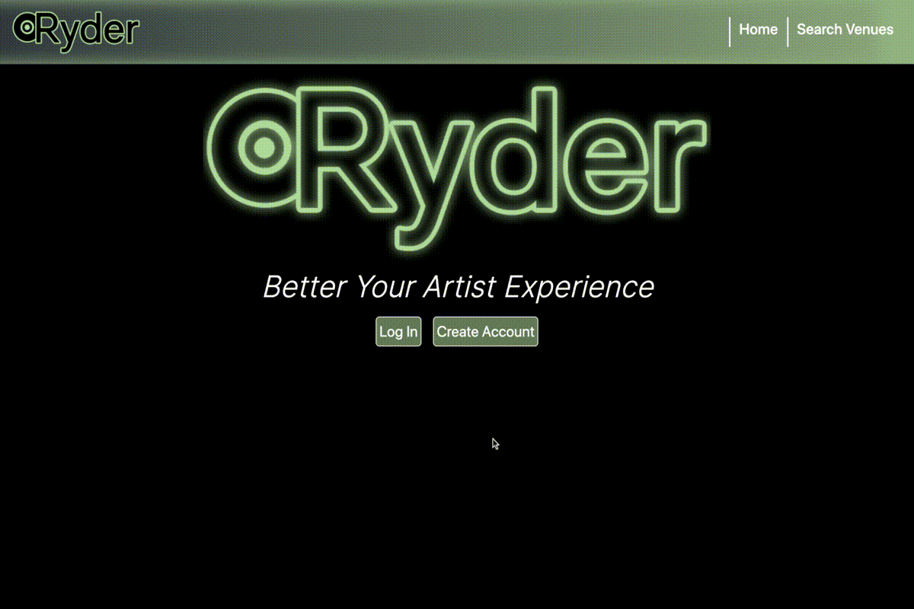

# Project Rydr


* [Rydr Deploy Link](https://rydr.vps.natemking.dev/)

* [Rydr Repository Link](https://github.com/natemking/rydr)

[](https://github.com/natemking/rydr/blob/main/LICENSE)


---
## Table of Contents
 * [Description](#description)
  * [Screenshots](#screenshots)
  * [License](#license)
  * [Credits](#credits)
  * [Authors](#authors)

## Description

In today's world with all the interconnectedness that we have, there still lacks a tried and true service for musical artists to interact with venues and share those experiences in a public manner. We have LinkedIn for employers and employees to connect. We have Glassdoor for employees to rate employers but what services do musical artists have? Are they not entering an, albeit temporary, employee-employer relationship for the extent of the gig? 

Along comes Rydr. A social network for artists to connect with other artist and view how venues have treated them. We allow artists the ability to rate venues, gone will be the days of venues mistreating the artists. To keep themselves honest, an artist can see others that have reviewed the venues previously.

By creating a social network of available places to play across the world, bands can easily book tours and be treated in a fair manner through transparency of the modern age. In the end it’s the fans who benefit. 


### Scope of Work

User Story:
```
As a musical artist 

I would like to be able to create an artist page.

So that I can share my band info

So that venues/promoters/booker can connect to books gigs.

I would like to be able to rate venues/promoter/booker.

So that other artists can know how a venue operates and treats artists.


``` 
<!-- 
### React

### MongoDB/Mongoose

### Node.js

### HTML/CSS -->

### Dependencies
```
|---------------------------------------------------|
|Server             |Client                         |
|-------------------|-------------------------------|
|axios              |axios                          |
|compression        |bootstrap                      |
|cookie-parser      |react-bootstrap                |
|dotenv             |react-cloudinary-upload widget |
|express            |react-google-recaptcha         |
|express-session    |react-rating                   |        
|if-env             |react-router-dom               |
|jsonwebtoken       |                               |     
|mongoose           |                               |
|morgan             |                               |
|passport           |                               |
|passport-jwt       |                               |
|passport-local     |                               |
|concurrently (dev) |                               |
|---------------------------------------------------|
*** client dependencies are on top of the boilerplate's from create-react-app ***
```

## Screenshots



<br>

_App Functionality_
<br>


## License
Licensed under the GNU GPLv3.0 License. Copyright © 2020

## Credits

### Authors:
* [David Wylie](https://github.com/wyliedavid1984)
* [Dmitri So](https://github.com/dmitriso)
* [John Hauth](https://github.com/jkhauth)
* [Nate King](https://github.com/natemking)

<!-- * [Add a comma to map results if there are more then one result](https://stackoverflow.com/questions/47881767/how-to-add-a-comma-in-array-map-after-every-element-except-last-element-in-react)

* [Find and update sub document](https://stackoverflow.com/questions/48494416/get-child-element-from-event-target)

* [Creating relationships w/ Mongoose](https://dev.to/oluseyeo/how-to-create-relationships-with-mongoose-and-node-js-11c8)  

* [FindByIdAndUpdate $push in Mongoose](https://stackoverflow.com/questions/15621970/pushing-object-into-array-schema-in-mongoose)
* [Mongoose CRUD](https://coursework.vschool.io/mongoose-crud/)

* [Limit the most recent results in ascending order w/ Mongoose](https://stackoverflow.com/questions/39069491/how-to-get-last-5-docs-in-sequential-order) -->


---


